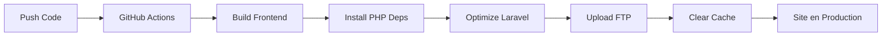

# 🚀 Guide de Déploiement Automatisé via FTP

## 📋 Vue d'ensemble

Ce projet Laravel/Inertia/React peut être déployé automatiquement vers un hébergement mutualisé via FTP en utilisant GitHub Actions ou un script local.

## 🔧 Méthode 1: GitHub Actions (Recommandé)

### Configuration des secrets GitHub

1. Allez dans `Settings > Secrets and variables > Actions` de votre repository
2. Ajoutez les secrets suivants :
   - `FTP_SERVER`: Adresse du serveur FTP (ex: ftp.votre-hebergeur.com)
   - `FTP_USERNAME`: Nom d'utilisateur FTP
   - `FTP_PASSWORD`: Mot de passe FTP
   - `FTP_PATH`: Chemin sur le serveur (ex: /public_html ou /www)

### Déclenchement du déploiement

Le déploiement se déclenche automatiquement lors d'un push sur les branches :
- `main`
- `production`

Vous pouvez aussi déclencher manuellement via l'onglet "Actions" sur GitHub.

## 🖥️ Méthode 2: Script Local

### Prérequis
```bash
# Installation de lftp (Linux/Mac)
sudo apt-get install lftp  # Ubuntu/Debian
brew install lftp          # Mac avec Homebrew
```

### Configuration
1. Éditez `deploy-ftp.sh` et remplacez les variables :
   ```bash
   FTP_SERVER="votre-serveur.com"
   FTP_USERNAME="votre-username"
   FTP_PASSWORD="votre-password"
   FTP_PATH="/public_html"
   ```

2. Rendez le script exécutable :
   ```bash
   chmod +x deploy-ftp.sh
   ```

3. Exécutez le déploiement :
   ```bash
   ./deploy-ftp.sh
   ```

## 📦 Ce qui est déployé

### ✅ Inclus
- Code PHP (app/, config/, routes/, etc.)
- Assets compilés (public/build/)
- Vues Blade (resources/views/)
- Fichiers publics (public/)
- Vendor PHP de production
- Migrations et seeders

### ❌ Exclus
- node_modules/
- .git/
- Tests
- Fichiers de développement (.env, docker, etc.)
- Logs et cache
- Documentation

## 🛠️ Actions Post-Déploiement

### Sur votre hébergeur, vous devrez :

1. **Configurer le .env** :
   - Copier `.env.example` vers `.env`
   - Configurer la base de données
   - Définir `APP_KEY` (php artisan key:generate)
   - Mettre `APP_ENV=production` et `APP_DEBUG=false`

2. **Permissions** :
   ```bash
   chmod -R 755 storage
   chmod -R 755 bootstrap/cache
   ```

3. **Créer le lien storage** (si SSH disponible) :
   ```bash
   php artisan storage:link
   ```
   Ou créer un script PHP temporaire :
   ```php
   <?php
   symlink('../storage/app/public', '../public/storage');
   ```

4. **Migrations** (si première installation) :
   ```bash
   php artisan migrate --seed
   ```

5. **Vider le cache** si erreurs :
   - Supprimer les fichiers dans :
     - `bootstrap/cache/*.php`
     - `storage/framework/cache/data/*`
     - `storage/framework/views/*`

## 🔄 Workflow de Déploiement



## 🚨 Troubleshooting

### Erreur "Class not found"
→ Vider le cache Laravel manuellement

### Assets non trouvés
→ Vérifier que `mix-manifest.json` existe dans `public/`

### Erreur 500
→ Vérifier les logs dans `storage/logs/`
→ Vérifier les permissions des dossiers
→ Vérifier la configuration .env

### FTP timeout
→ Augmenter le timeout dans le script
→ Déployer en heures creuses
→ Utiliser moins de connexions parallèles

## 🎯 Checklist de Déploiement

- [ ] Build frontend réussi
- [ ] Tests passés (si configurés)
- [ ] .env.production configuré
- [ ] Secrets GitHub configurés
- [ ] Backup de la base de données effectué
- [ ] Maintenance mode activé si nécessaire
- [ ] Cache vidé après déploiement
- [ ] Vérification du site en production

## 🔐 Sécurité

1. **Ne jamais commiter** :
   - Fichiers .env
   - Clés API
   - Mots de passe

2. **Utiliser les secrets GitHub** pour les informations sensibles

3. **Activer HTTPS** sur votre hébergement

4. **Désactiver le debug** en production (`APP_DEBUG=false`)

## 📊 Monitoring

Après déploiement, surveillez :
- Les logs d'erreur (`storage/logs/`)
- Les performances (temps de réponse)
- L'utilisation des ressources
- Les erreurs 404/500

## 💡 Tips d'Optimisation

1. **Utiliser un CDN** pour les assets statiques
2. **Activer la compression** côté serveur
3. **Configurer le cache** navigateur via .htaccess
4. **Optimiser les images** avant déploiement
5. **Minifier CSS/JS** (déjà fait par Vite)

---

Pour toute question ou problème, consultez la documentation Laravel et Inertia.js.